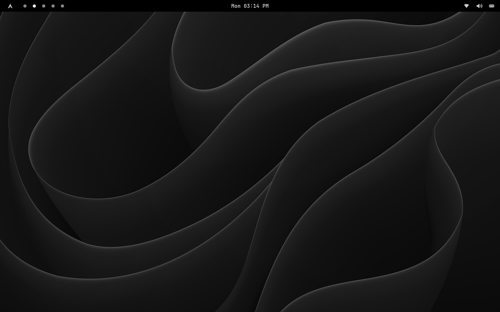
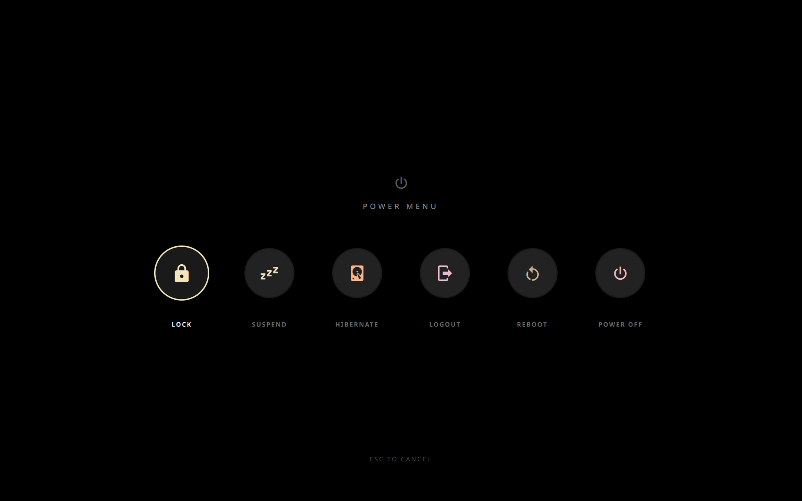
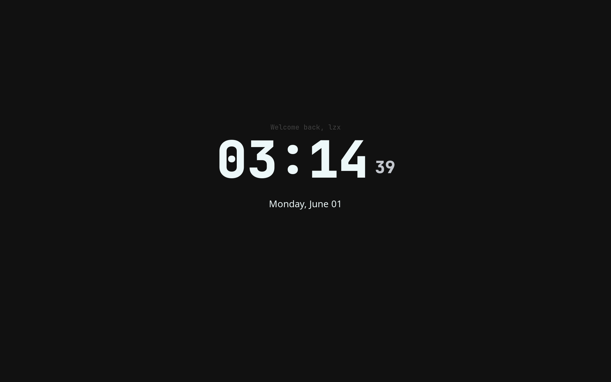
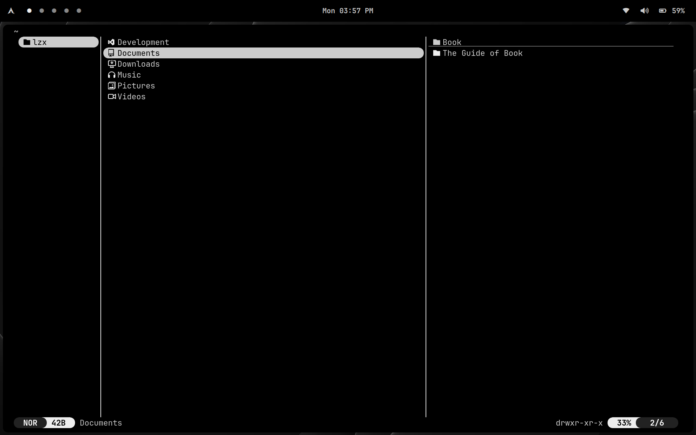
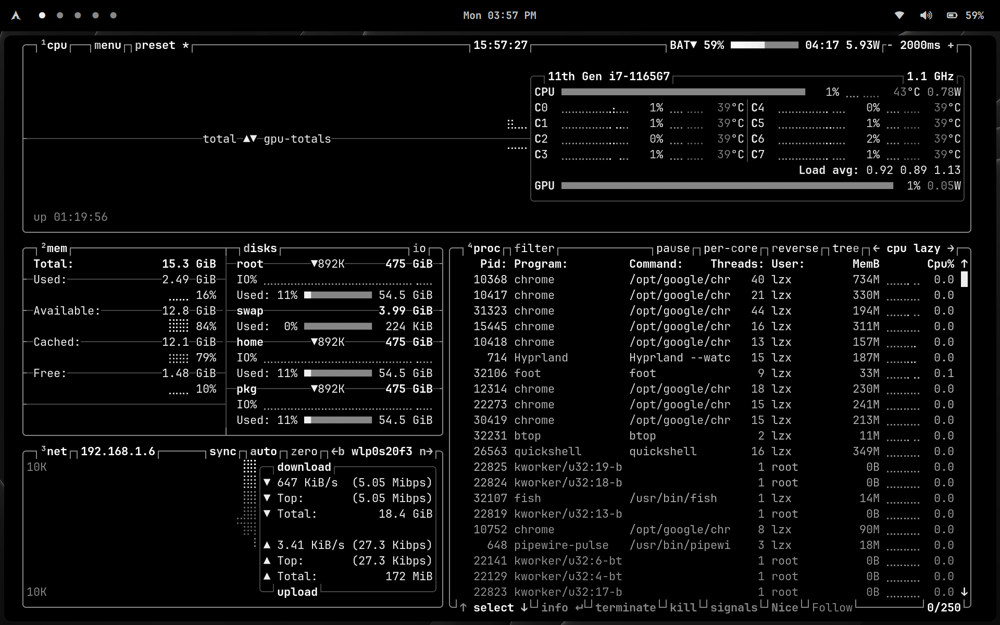
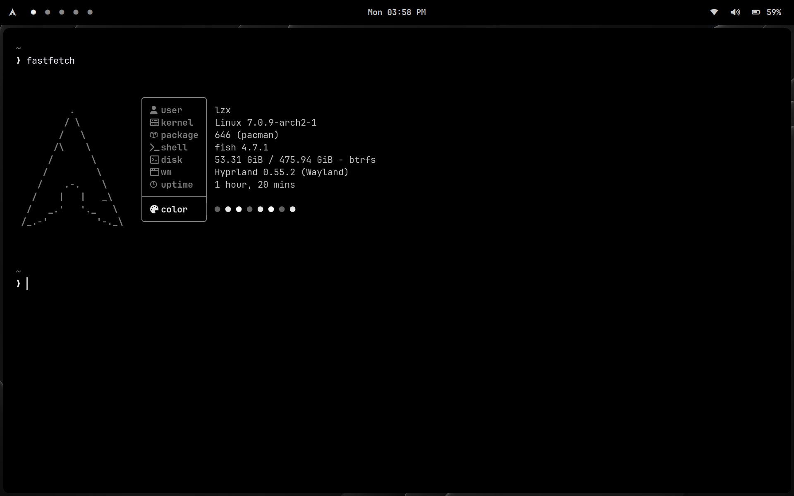
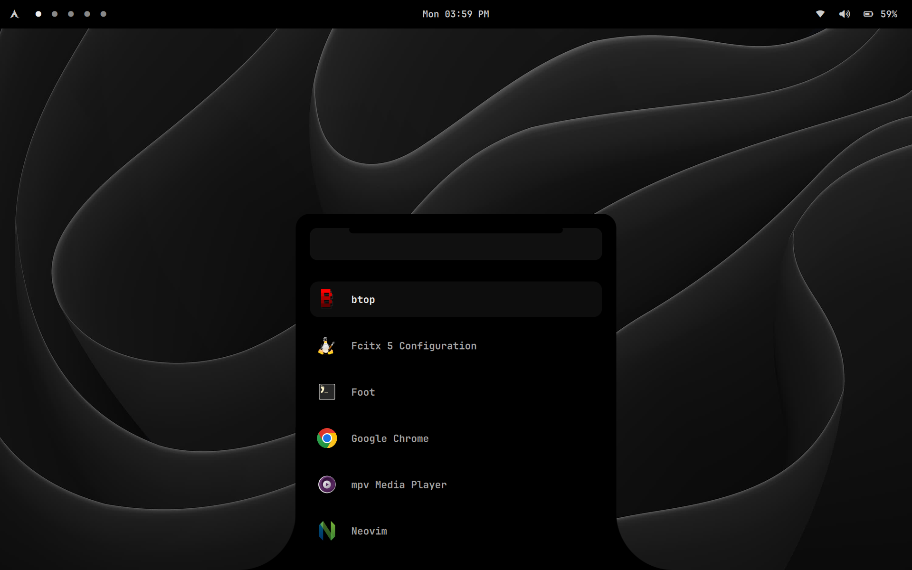
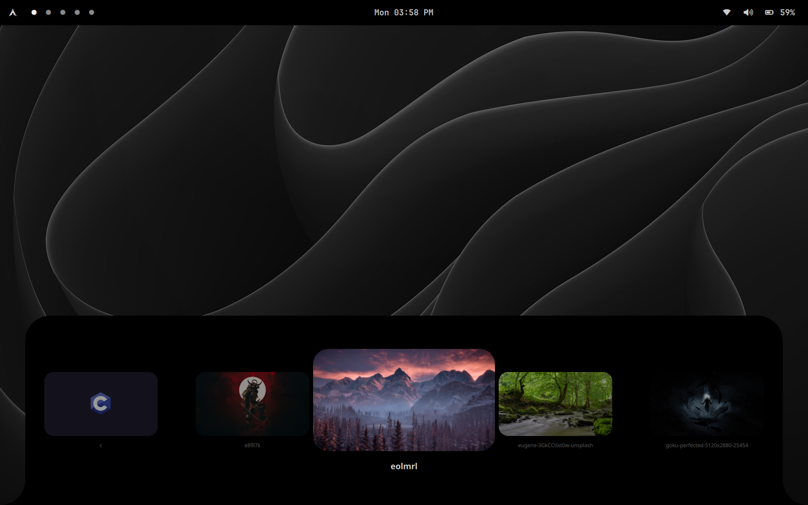
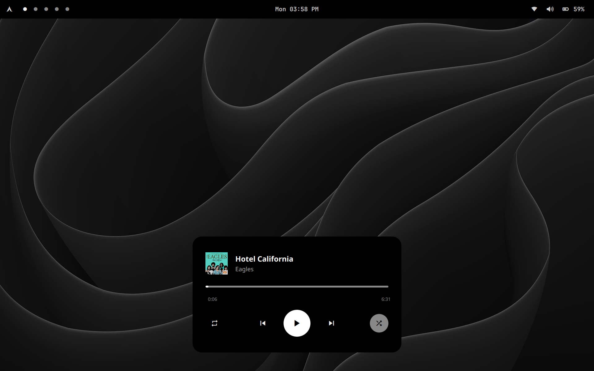

# lzxuan-dots

A Hyprland configuration with minimal black and white e-ink themes, and essential tools for a beautiful Wayland desktop experience.

## Showcase

  
  
  

<i>System Overview</i>

 

  
  
  

<i>File Management & System Monitoring</i>

 

  
  
  

<i>UI Components & Media</i>

---

### Hyprland Ecosystem

| Description        | Tool                                           | Language |
| :----------------- | :--------------------------------------------- | :------: |
| Wayland compositor | [Hyprland](https://github.com/hyprwm/Hyprland) | ![][cpp] |
| Idle daemon        | [hypridle](https://github.com/hyprwm/hypridle) | ![][cpp] |
| Screen locker      | [hyprlock](https://github.com/hyprwm/hyprlock) | ![][cpp] |
| Color picker       | [hyprpicker](https://github.com/hyprwm/hyprpicker) | ![][cpp] |

### Wayland Utilities

| Description              | Tool                                        | Language |
| :----------------------- | :------------------------------------------ | :------: |
| Wallpaper Manager        | [awww](https://codeberg.org/LGFae/awww)     | ![][rs]  |
| Notification Daemon      | [mako](https://github.com/emersion/mako)    |  ![][c]  |
| Minimal Wayland Launcher | [rofi](https://github.com/davatorium/rofi)  |  ![][c]  |
| Status Bar               | [waybar](https://github.com/Alexays/Waybar) | ![][cpp] |
| Music Player Daemon      | [mpd](https://github.com/musicplayerdaemon/mpd) | ![][cpp]|
| Quickshell               | [quickshell](https://quickshell.org/)       | ![][cpp] |

 

### Tools

| Role                     | Tool                                                | Language |
| :----------------------- | :-------------------------------------------------- | :------: |
| Editor                   | [nvim](https://github.com/neovim/neovim)            | ![][vim] |
| Interactive shell        | [fish](https://fish.com/)                           |  ![][c]  |
| Wayland terminal         | [foot](https://codeberg.org/dnkl/foot)              |  ![][c]  |
| Prompt engine            | [starship](https://github.com/starship/starship)    | ![][rs]  |
| File Manager             | [yazi](https://github.com/sxyazi/yazi)              | ![][rs]  |
| Grim                     | [grim](https://sr.ht/~emersion/grim/)               | ![][c]   |
| Slurp                    | [slurp](https://github.com/emersion/slurp)          | ![][c]   |
| Tesseract                | [tesseract](https://github.com/tesseract-ocr/tesseract) | ![][cpp]|
| Mpc                      | [mpc](https://github.com/MusicPlayerDaemon/mpc)     | ![][c]   |

 
 

## Disclaimer

This repository is intended to provide a configuration reference, preview, and demonstration for users who appreciate a minimalist black-and-white (e-ink) aesthetic on Linux.

This configuration is tailored to my personal environment. Given that the Hyprland ecosystem and its components (such as Quickshell, waybar, rofi, etc.) update frequently, some configurations may become outdated or experience issues if you clone them directly. 

 I recommend using these files as a guide while adjusting them to your specific system environment. Please refer to the official documentation of each tool to ensure compatibility with your current kernel version and installed plugins. Thank you :)

<!-- Language badges -->

[rs]: https://img.shields.io/badge/-rust-orange
[vim]: https://img.shields.io/badge/-vim-green
[cpp]: https://img.shields.io/badge/-c%2B%2B-red
[c]: https://img.shields.io/badge/-c-lightgrey
